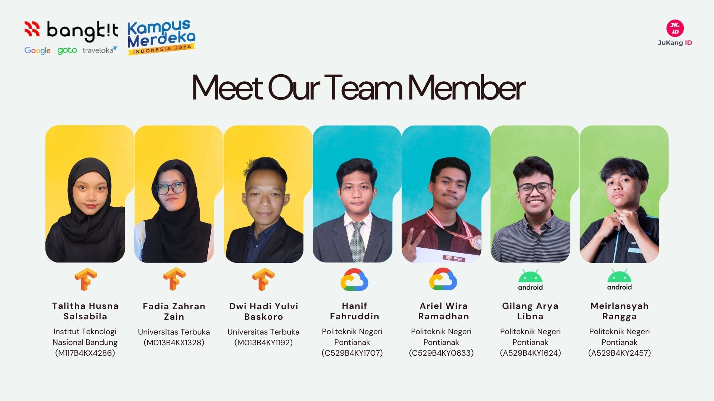

## C242-PS117 JuKang ID | Product-based Capstone Project
*"Juru Tukang ID: Reliable, Fast, and Transparent Home Solutions."*

#### **Theme:** Economics Empowerment: Navigating Sustainable Economies for All

This project helps homeowners in Indonesia easily find reliable handymen for repairs, construction, or renovations. Many people struggle with uncertainties around pricing, quality, and availability when relying on personal recommendations. Our application solves this by connecting users to professional handymen, providing clear details about skills, availability, ratings, and pricing, making the process faster and more reliable.

We use cloud computing to power the backend with JavaScript and the Hapi framework for creating REST APIs. The backend is deployed on Google Cloud Run using a continuous deployment method, allowing updates and changes to be implemented easily without disrupting the service. This ensures the application remains efficient and scalable as user needs grow.

The app also features a recommendation system using RNN-LSTM to suggest suitable handymen based on common repair problems. With its simple design and practical features, users can confidently book handyman services while workers can find jobs that match their skills, creating a transparent and efficient solution for everyone involved.

### Team Member

| **Bangkit ID**    | **Name**                   | **Learning Path**   | **University**                     | **LinkedIn**                                                                                                                                              |
|--------------------|----------------------------|---------------------|-------------------------------------|---------------------------------------------------------------------------------------------------------------------------------------------------------|
| M117B4KX4286       | Talitha Husna Salsabila   | Machine Learning    | Institut Teknologi Nasional Bandung | |
| M013B4KX1328       | Fadia Zahran Zain         | Machine Learning    | Universitas Terbuka                 |                       |
| M013B4KY1192       | Dwi Hadi Yulvi Baskoro    | Machine Learning    | Universitas Terbuka                 |                       |
| C529B4KY1707       | Hanif Fahruddin           | Cloud Computing     | Politeknik Negeri Pontianak         |                       |
| C529B4KY0633       | Ariel Wira Ramadhan       | Cloud Computing     | Politeknik Negeri Pontianak         |                       |
| A529B4KY1624       | Gilang Arya Libna         | Mobile Development  | Politeknik Negeri Pontianak         |                       |
| A529B4KY2457       | Meirlansyah Rangga        | Mobile Development  | Politeknik Negeri Pontianak         |                       |

### Video Documentation
- Youtube Presentation: 
- Live Demo Application: 
  
### Download Apps
- You can download it here: 
